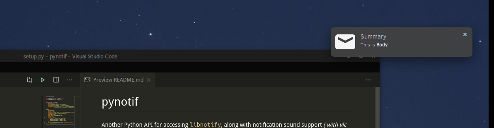

# pynotif

Another Python API for accessing `libnotify`, along with notification sound support _( with `vlc` backend )_.



**Caution : _Well you've to go through a rigorous installation prodecure, which may not be a preferred choice always. But it's pretty assured, you'll get to learn something new._** :wink:

## setup

I'll demonstrate installation procedure on `Solus Linux`.

### prerequisites

- Make sure you've `gcc`, `glibc`, `glibc-devel` installed. I'll use `gcc 9.3.0`.
    ```bash
    $ sudo eopkg it gcc, glibc, glibc-devel
    $ gcc --version # check version
    ```
- Python3.x _(x>=7)_ required. For installing `Cython`, we'll install `pip` too. I'm using `Python3.7.6`.
    ```bash
    $ sudo eopkg it python3, python3-devel, pip
    $ python3 --version
    $ python3 -m pip install --user Cython
    ```
- Let's install `libnotify`, `libnotify-devel`, which will be giving us programmatic interface for talking to libnotify from our C-library.
    ```bash
    $ sudo eopkg it libnotify libnotify-devel
    ```
- Well you can send notification from terminal using
    ```bash
    $ notify-send "Summary" "Body of Notification"
    ```
- Last but not least `vlc`, which will be used for playing notification sound, might be helpful for alerting user.
    ```bash
    $ sudo eopkg it vlc vlc-devel
    ```

### installation

- Let's first go to a convenient location in directory hierarchy of your machine, where you can clone this repo & start working.
    ```bash
    $ git clone https://github.com/itzmeanjan/pynotif.git
    ```
- Get into `pynotif` directory and check content of directories.
    ```bash
    $ cd pynotif
    $ tree -h
    .
    ├── [4.0K]  libnotification
    │   ├── [2.4K]  play_sound.c
    │   ├── [  45]  play_sound.h
    │   ├── [2.4K]  send_notification.c
    │   └── [ 235]  send_notification.h
    ├── [1.0K]  LICENSE
    ├── [4.0K]  pynotif
    │   ├── [1.5K]  pynotif.pyx
    │   └── [1.1K]  setup.py
    ├── [7.0K]  README.md
    ├── [4.0K]  sound
    │   ├── [ 30K]  button_sound.wav
    │   └── [ 29K]  when.mp3
    └── [4.0K]  ss
        └── [ 71K]  screenshot.png

    4 directories, 11 files
    ```

- First we're going to `libnotification`, which is going to be compiled into a static C-library. File names are pretty self-explanatory, for what purpose they serve.

    ```bash
    $ cd libnotification
    $ ls
    play_sound.c  play_sound.h  send_notification.c  send_notification.h
    ```
- Time to compile each of these C files and generate object code.
    ```bash
    $ gcc -c play_sound.c
    $ gcc -I /usr/include/glib-2.0/ -I /usr/include/gdk-pixbuf-2.0/ -I /usr/lib64/glib-2.0/include/ -c send_notification.c
    ```

- Now we need to archive these object files into a static library, which will be invoked from `Cython` code _(*.pyx file)_.
    ```bash
    $ ar rcs libnotification.a play_sound.o send_notification.o
    ```

- As we've obtained static library, compiled object codes can be removed now. You may consider checking kind of generated static library.
    ```bash
    $ rm *.o
    $ file libnotification.a
    libnotification.a: current ar archive
    ```

- Now we'll get into `pynotif` directory, which holds cython code, required for talking to C-library, `libnotification.a`.
    ```bash
    $ cd ../pynotif
    $ ls
    pynotif.pyx  setup.py
    ```

- `pynotif.pyx` holds cython code for interfacing with `libnotification.a`, which is to be compiled into equivalent C code _( using Cython compiler )_. Then we'll build C extension library _( dynamically linked library )_, which can be invoked from Python.
    ```bash
    $ python3 setup.py build_ext --inplace
    Compiling pynotif.pyx because it changed.
    [1/1] Cythonizing pynotif.pyx
    running build_ext
    building 'pynotif' extension
    creating build
    creating build/temp.linux-x86_64-3.7
    x86_64-solus-linux-gcc -pthread -Wno-unused-result -Wsign-compare -DNDEBUG -g -fwrapv -O3 -Wall -mtune=generic -march=x86-64 -g2 -pipe -fPIC -Wformat -Wformat-security -D_FORTIFY_SOURCE=2 -fstack-protector-strong --param ssp-buffer-size=32 -fasynchronous-unwind-tables -ftree-vectorize -feliminate-unused-debug-types -Wall -Wno-error -Wp,-D_REENTRANT -fno-semantic-interposition -O3 -falign-functions=32 -I/usr/include -mtune=generic -march=x86-64 -g2 -pipe -fPIC -Wformat -Wformat-security -D_FORTIFY_SOURCE=2 -fstack-protector-strong --param ssp-buffer-size=32 -fasynchronous-unwind-tables -ftree-vectorize -feliminate-unused-debug-types -Wall -Wno-error -Wp,-D_REENTRANT -fno-semantic-interposition -O3 -falign-functions=32 -fPIC -I/usr/include/glib-2.0/ -I/usr/include/gdk-pixbuf-2.0/ -I/usr/lib64/glib-2.0/include/ -I../libnotification/ -I/usr/include/python3.7m -c pynotif.c -o build/temp.linux-x86_64-3.7/pynotif.o
    x86_64-solus-linux-gcc -pthread -shared -Wl,--copy-dt-needed-entries -Wl,-O1 -Wl,-z,relro -Wl,-z,now -Wl,-z,max-page-size=0x1000 -Wl,-Bsymbolic-functions -Wl,--sort-common -Wl,--copy-dt-needed-entries -Wl,-O1 -Wl,-z,relro -Wl,-z,now -Wl,-z,max-page-size=0x1000 -Wl,-Bsymbolic-functions -Wl,--sort-common build/temp.linux-x86_64-3.7/pynotif.o -L/usr/lib64/ -L../libnotification/ -L/usr/lib64 -lvlc -lnotify -lnotification -lpython3.7m -o /home/anjan/Documents/my_programs/still_working/open/pynotif/pynotif/pynotif.cpython-37m-x86_64-linux-gnu.so

    $ tree -h
    .
    ├── [4.0K]  build
    │   └── [4.0K]  temp.linux-x86_64-3.7
    │       └── [203K]  pynotif.o
    ├── [125K]  pynotif.c
    ├── [146K]  pynotif.cpython-37m-x86_64-linux-gnu.so
    ├── [1.5K]  pynotif.pyx
    └── [1.1K]  setup.py

    2 directories, 5 files
    ```

- `pynotif.*.so` is our statically linked shared object, which is of interest. `./build` directory & `pynotif.c` can be deleted. But you might be interested in taking a look at `pynotif.c`, which is generated C code from `pynotif.pyx` by `Cython` compiler.
    ```bash
    $ rm build/ pynotif.c -rv
    $ file pynotif.cpython-*.so # check it out
    ```
- Now you can use `pynotif`, but only from this working directory. Lets check that first.
    ```bash
    $ python3
    >>> import pynotif
    >>> pynotif.__version__
    '0.1.0'
    >>> pynotif.startNotif(b"My Application")
    1
    >>> pynotif.sendNotif(b"Summary", b"Body of Notification", 2, 1, b"/path/to/icon/file", b"/path/to/notification/sound/file")
    1
    >> pynotif.stopNotif()
    >>> help()
    help > pynotif # shows you API documentation
    ...
    ```

- But we want to make it available to all scripts installed on this machine, Don't we ? Then we'll install this library into some standard location.
    ```bash
    $ python3 setup.py install --user
    ```

- Now go to `$HOME` directory & invoke Python3 repl prompt.
    ```bash
    $ cd
    $ python3
    >> import pynotif # and it works as expected
    ```

- **Congratulations, you've successfully built & installed `pynotif` from C-library. Now use as you wish.**


Thanking you :wink:
