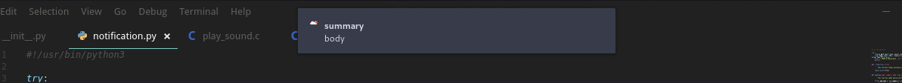

# pynotif

Another Python API for accessing `libnotify`, along with notification sound support _( with vlc backend )_.

## compilation

- [libnotification](./libnotification) is a C library using 

    - `libnotify` to display desktop notification on GNU/Linux
    - `vlc` to play notification sound

- Now `libnotification` to be compiled into a static library
    - Get into libnotification directory
        ```bash
        $ cd libnotification
        ```
    - Compiling `play_sound.c`
        ```bash
        $ gcc -c play_sound.c
        ```
    - Now compiling `send_notification.c`
        ```bash
        $ gcc -I /usr/include/glib-2.0/ -I /usr/include/gdk-pixbuf-2.0/ -I /usr/lib64/glib-2.0/include/ -c send_notification.c
        ```
    - Making Static library
        ```bash
        $ ar rcs libnotification.a play_sound.o send_notification.o
        ```

- Time to generate python binding for `pynotif` using `Cython`
```bash
$ cd ../pynotif
$ python3 setup.py build_ext --inplace
$ rm build/ pynotif.c -r # removing everything except Shared Object module
```

**More coming soon ...**

## example




Thanking you :wink:
